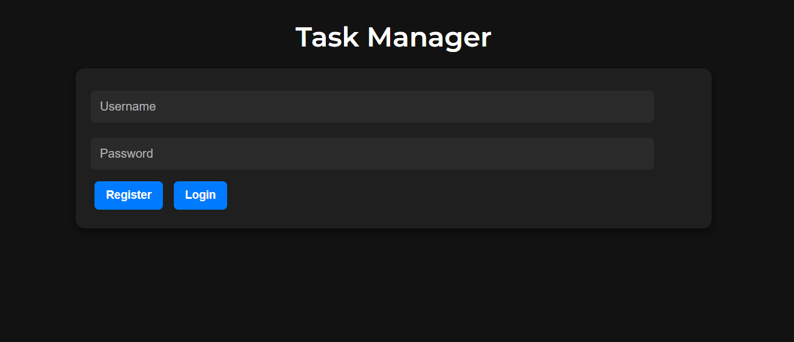
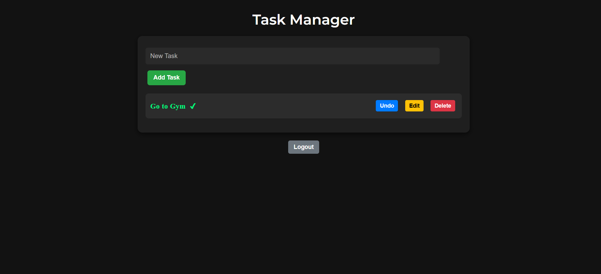

# ✅ Task Manager

A simple **Task Management Web App** built with **Node.js, Express, MongoDB (Backend)** and **HTML, CSS, JavaScript (Frontend)**.  
Includes **User Authentication (JWT)** and **Task CRUD operations**.

---

## 🚀 Features
- 🔐 **User Authentication** (Register/Login) using JWT
- ✅ Add, Edit, Complete/Undo, and Delete tasks
- 🎨 **Dark Theme UI** with stylish fonts
- 💾 Persistent tasks stored in MongoDB
- 🔄 Auto-login with token stored in localStorage
- 🔑 Secure routes using middleware

---

## 🛠 Tech Stack
- **Backend:** Node.js, Express.js, MongoDB, Mongoose
- **Frontend:** HTML, CSS (Dark Theme), JavaScript (Fetch API)
- **Authentication:** JWT
- **Tools:** Postman, Git, Vercel/Render for deployment

---

## 📂 Project Structure
```
P1-TASK-MANAGER/
│
├── backend/
│   ├── middleware/
│   │   └── authMiddleware.js      # JWT verification middleware
│   ├── models/
│   │   ├── task.js                # Task schema
│   │   └── user.js                # User schema
│   ├── routes/
│   │   ├── authRoutes.js          # Login/Register routes
│   │   └── taskRoutes.js          # Task CRUD routes
│   ├── .env                       # Environment variables
│   └── server.js                  # Main Express server
│
├── frontend/
│   ├── app.js                     # Handles UI and API calls
│   ├── index.html                 # Main HTML file
│   └── style.css                  # Dark theme styles
│
├── node_modules/
├── package.json
├── package-lock.json
└── .gitignore
```

---

## ⚙️ Installation & Setup

### 1️⃣ Clone the Repository
```
git clone https://github.com/your-username/P1-TASK-MANAGER.git
cd P1-TASK-MANAGER
```

### 2️⃣ Install Dependencies
```
npm install
```

### 3️⃣ Setup Environment Variables
Create a **.env** file inside `backend/` with:
```
PORT=5000
MONGO_URI=your_mongodb_connection_string
JWT_SECRET=your_jwt_secret
```

### 4️⃣ Run the Server
```
cd backend
node server.js
```

---

## ▶️ Usage
- Open `frontend/index.html` in a browser.
- Register or Login.
- Add, Edit, Complete, or Delete tasks.
- Click **Logout** to end session.

---

## 📸 Screenshot

##


---

## 🔮 Future Enhancements
- ✅ Responsive UI for mobile devices
- ✅ Add task categories and due dates
- ✅ Drag & Drop for task ordering
- ✅ Deploy frontend & backend together

---

🔥 Happy Coding!
